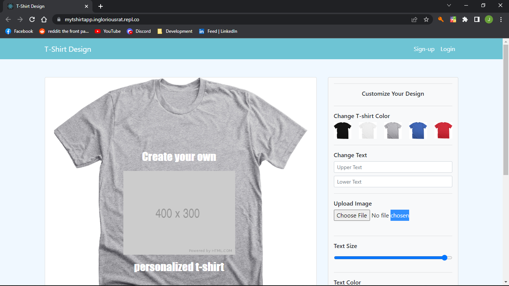
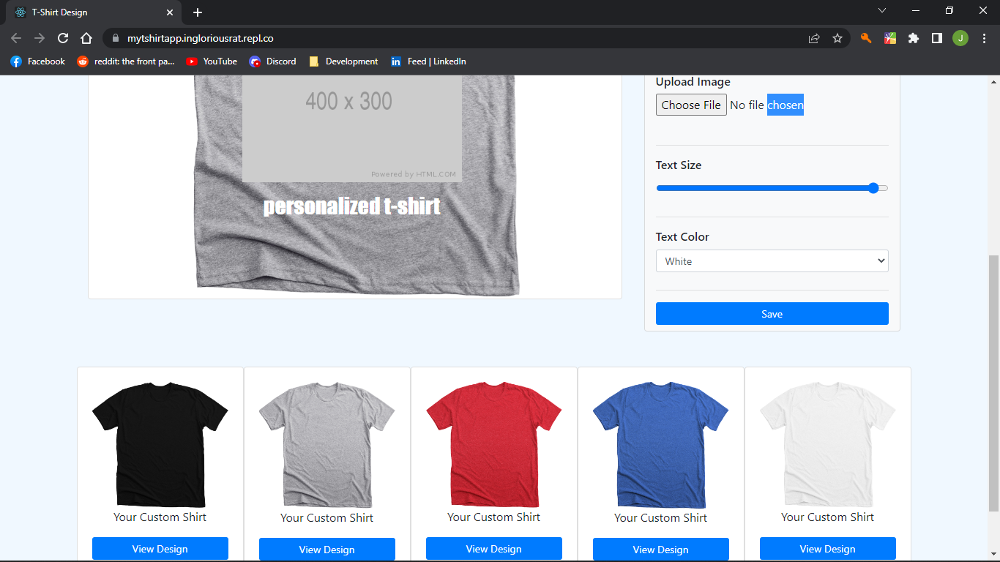

## mytshirtapp
##### Interactive Custom T-Shirt Design Builder
#####  React-Redux Progressive Web App
##### This project was bootstrapped with [Create React App](https://github.com/facebook/create-react-app)

____
#### <h6 align="center">[Live Version](https://mytshirtapp.ingloriousrat.repl.co/)</h6>

---- 
#### **Features & Build Concepts:**
* Customize your own t-shirt design with text editing, color picker, and image file upload.   
* Save your design and create multiple concurrent projects.   
* Return to any active project to review and/or make changes.  
 * Save and send your designs to the Store for order submission.  
#### **To Do:**
* Save the entirety of t-shirt project to Firebase/Firestore
* Implement secured read/write access to projects
* Add option to forward saved projects to T-shirt design & printing websites for pricing quote
##### Note: Firestore config currently incomplete for this commit and is to be rendered in next the stage of build.
---
#### **Installed Packages**
##### This application uses the following [open source] packages: 
[ReactJS](https://reactjs.org/docs/getting-started.html) 
[React Redux](https://react-redux.js.org/introduction/getting-started) 
[React Router](https://reactrouter.com/docs/en/v6) 
[Google Firebase](https://firebase.google.com/docs)
___
Use the `npm start` command to run the development server or any of the built-in React Scripts listed below:

`"start": "react-scripts start",` 
`"build": "react-scripts build",` 
`"test": "react-scripts test",` 
`"eject": "react-scripts eject"`

##### Note: This application is currently in development mode and it is *not* recommended to run the `build` or `eject` script modes at his point.
___
#### **Reporting Bugs or Issues:**
 If you would like to report a **Bug** or **Issue** in this repo feel free to do so under the **Issues** tab or contact me directly about any major concerns. Ideas for improvements or enhancements to this project are also encouraged. Please address these matters by sending a **Pull Request** as they will be reviewed for potential consideration. 
___
#### Contributing
* **Clone** this repository and create a new branch: 
  `$ git clone https://github.com/inglorious-ratbastard/mytshirtapp.git -b name_of_new_branch`
* Introduce a new feature, fix an existing bug, or clean up current code 
* Please throroughly **Test** the changes that have been implemented [*Jest* testing suite is included]
* Submit a **Pull Request** accurately explaining the changes that were made to this repository
##### Your contribution will be review and considered for merge into Main or a separate branch. Thank you for assisting in the development of this project.
___
#### Acknowledgements
I would like to thank [Coding Project](https://www.youtube.com/channel/UCh57w1GkqyawHVsMamtvXXg) on YouTube for providing the initial design for this project. You can view the entire [playlist](https://www.youtube.com/playlist?list=PLJY7Huvi0ogNrdjuFi0zvka1SLNhR2kyz) for building this web application to render the original version. 
___
