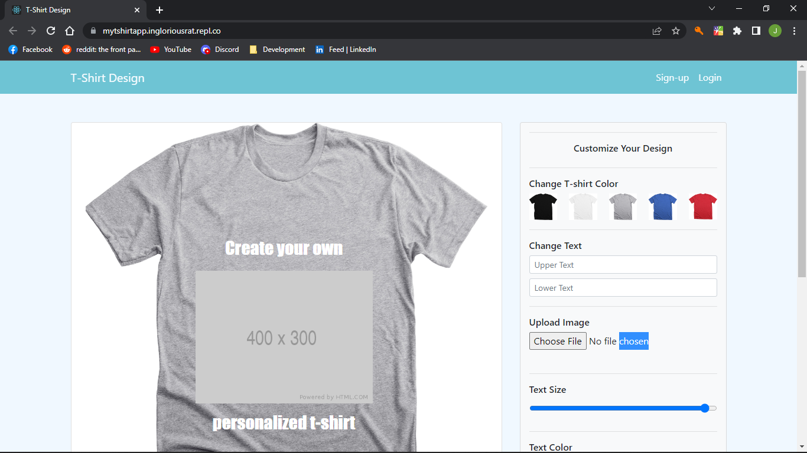
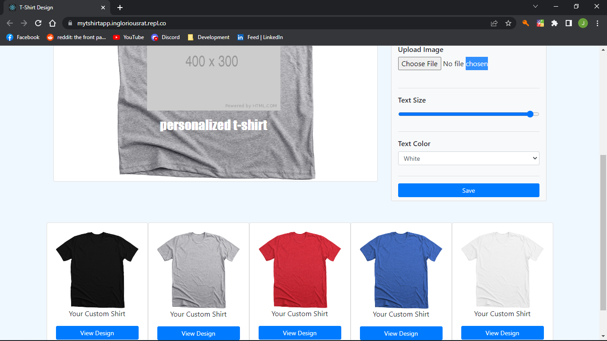

## mytshirtapp
##### An interactive React-based T-shirt design builder that allows users to create, customize, and manage their own designs. Built as a modern Progressive Web App, the project combines a simple design experience with tools for managing saved projects and exploring custom T-shirt creation.

##### Interactive Custom T-Shirt Design Builder
#####  React-Redux Progressive Web App
##### This project was bootstrapped with [Create React App](https://github.com/facebook/create-react-app)


____

#### <h5 align="center">Application Preview</h5>



---- 

##### <ins>About This Repository</ins>:

##### **mytshirtapp** is an interactive T-shirt design builder built as a React-based Progressive Web App (PWA). The project is designed to give users a simple, browser-based workspace where they can create, customize, save, and manage their own T-shirt designs.

##### The application combines **React, Redux, React Router, and Firebase** to provide a foundation for managing the design experience, application state, navigation, and persistent project data. The project also uses middleware and service-worker functionality to support its PWA architecture.

##### This repository represents an ongoing development project, with the current implementation focused on the core design and project-management experience. Future development is intended to expand the Firebase/Firestore integration, improve project security, and connect saved designs with external T-shirt printing and ordering services.

##### The project is currently deployed as a live web application through Vercel and can be accessed here:

**[Live Demo](https://mytshirtapp.vercel.app/)**

##### <ins>Project Goals</ins>:

* ##### Provide an intuitive interface for creating custom T-shirt designs.
* ##### Allow users to maintain multiple design projects.
* ##### Keep the design workflow entirely accessible through the browser.
* ##### Build a foundation for persistent cloud-based project storage.
* ##### Eventually connect completed designs with printing and ordering services.
* ##### Explore the use of React, Redux, Firebase, and PWA technologies in a complete application.

##### This repository is both a functional application and an ongoing development project, with additional features and integrations planned as the application evolves.

##### <ins>Features & Build Concepts</ins>:
* ##### Customize your own t-shirt design with text editing, color picker, and image file upload. <br> 
* ##### Save your design and create multiple concurrent projects. <br> 
* ##### Return to any active project to review and/or make changes. <br>
* ##### Save and send your designs to the Store for order submission. <br>
##### <ins>To Do</ins>:
* ##### Save the entirety of t-shirt project to Firebase/Firestore
* ##### Implement secured read/write access to projects
* ##### Add option to forward saved projects to T-shirt design & printing websites for pricing quote
  
##### Note: Firestore config currently incomplete for this commit and is to be rendered in next the stage of build.
---

#### <ins>Repository Structure</ins>:

##### The project is organized around a React application with separate areas for components, pages, state management, Firebase services, and supporting PWA functionality.

```
mytshirtapp/
├── public/
│   ├── images/
│   ├── favicon.ico
│   └── manifest.json
│
├── src/
│   ├── components/
│   │   ├── ...
│   │   └── ...
│   │
│   ├── pages/
│   │   ├── ...
│   │   └── ...
│   │
│   ├── redux/
│   │   ├── actions/
│   │   ├── reducers/
│   │   └── store.js
│   │
│   ├── firebase/
│   │   └── ...
│   │
│   ├── App.js
│   ├── index.js
│   ├── serviceWorker.js
│   └── ...
│
├── package.json
├── package-lock.json
├── README.md
└── ...
```

##### <ins>Key Areas</ins>:

* ##### **`public/`** — Static assets and files that are served directly by the application.
* ##### **`src/components/`** — Reusable React components used throughout the application.
* ##### **`src/pages/`** — Page-level components representing the application's primary views and routes.
* ##### **`src/redux/`** — Redux state management, including actions, reducers, and the application store.
* ##### **`src/firebase/`** — Firebase configuration and services used for authentication and persistent application data.
* ##### **`App.js`** — Defines the primary application structure and routing.
* ##### **`index.js`** — Application entry point responsible for mounting the React application.
* ##### **`serviceWorker.js`** — Supports the Progressive Web App functionality.
* ##### **`package.json`** — Defines project dependencies, scripts, and package configuration.

##### As the application continues to develop, the repository structure may evolve as additional design tools, Firebase functionality, authentication, and external printing integrations are introduced.

---
##### <ins>Installed Packages</ins>:
##### This application uses the following [open source] packages:<br>
[ReactJS](https://reactjs.org/docs/getting-started.html)<br>
[React Redux](https://react-redux.js.org/introduction/getting-started)<br>
[React Router](https://reactrouter.com/docs/en/v6)<br>
[Google Firebase](https://firebase.google.com/docs)
___
##### Use the `npm start` command to run the development server or any of the built-in React Scripts listed below:

`"start": "react-scripts start",`<br>
`"build": "react-scripts build",`<br>
`"test": "react-scripts test",`<br>
`"eject": "react-scripts eject"`

##### Note: This application is currently in development mode and it is *not* recommended to run the `build` or `eject` script modes at his point.
___
##### **Reporting Bugs or Issues:**
##### If you would like to report a **Bug** or **Issue** in this repo feel free to do so under the **Issues** tab or contact me directly about any major concerns. Ideas for improvements or enhancements to this project are also encouraged. Please address these matters by sending a **Pull Request** as they will be reviewed for potential consideration. 
___
##### <ins>Contributing</ins>:

* ##### **Clone** this repository and create a new branch:<br>
  `$ git clone https://github.com/inglorious-ratbastard/mytshirtapp.git -b name_of_new_branch`
* ##### Introduce a new feature, fix an existing bug, or clean up current code 
* ##### Please throroughly **Test** the changes that have been implemented [*Jest* testing suite is included]
* ##### Submit a **Pull Request** accurately explaining the changes that were made to this repository
  
##### Your contribution will be review and considered for merge into Main or a separate branch. Thank you for assisting in the development of this project.
___
##### <ins>Acknowledgements</ins>:
##### I would like to thank [Coding Project](https://www.youtube.com/channel/UCh57w1GkqyawHVsMamtvXXg) on YouTube for providing the initial design for this project. You can view the entire [playlist](https://www.youtube.com/playlist?list=PLJY7Huvi0ogNrdjuFi0zvka1SLNhR2kyz) for building this web application to render the original version. 
___
